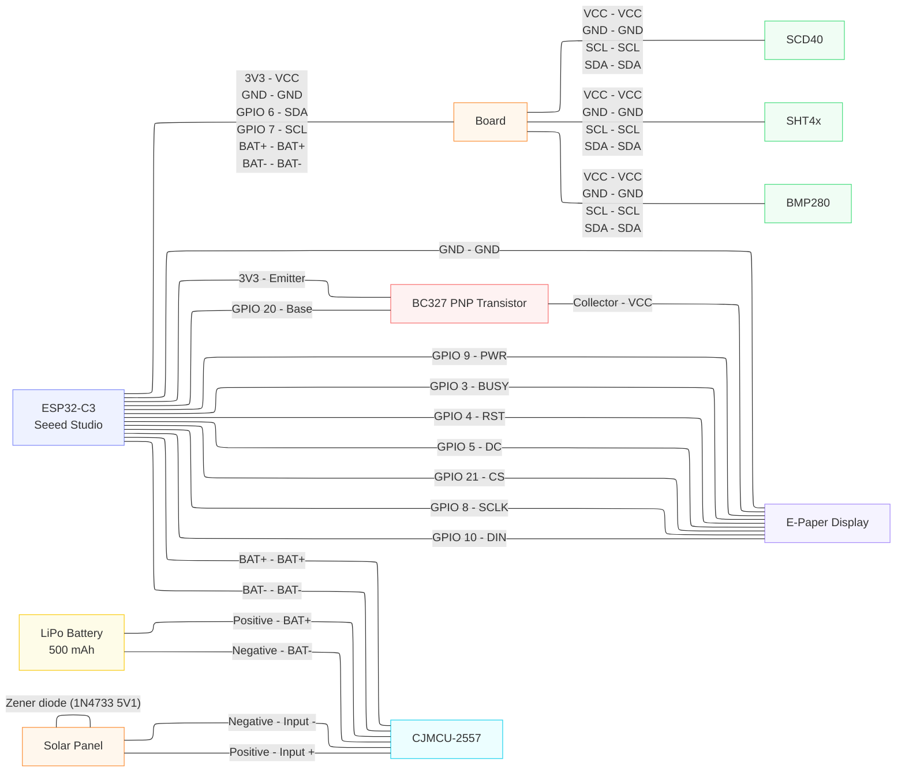

# 🌡️ AirAnalyzer

A DIY ESP32-based environmental monitor with an e-paper display!

|||
|:--:|:--:|
|Outside|Inside|

## What it does

- Measures **temperature**, **humidity**, **CO2**, and **pressure**
- Fetches **weather forecast** from Open-Meteo API
- Shows **sunrise/sunset** times
- Uploads data to **ThingSpeak**
- Runs on **deep sleep** for low power consumption

## Hardware

- ESP32-C3
- SCD40 (CO2 sensor)
- SHT4x (temperature & humidity)
- BMP280 (pressure)
- 3.97" e-paper display

## Connections

## Setup

1. Copy `include/config.example.h` to `include/config.h`
2. Add your WiFi credentials and ThingSpeak API key
3. Build & upload with PlatformIO

---

_Icons converted using [image2cpp](https://javl.github.io/image2cpp/)_
